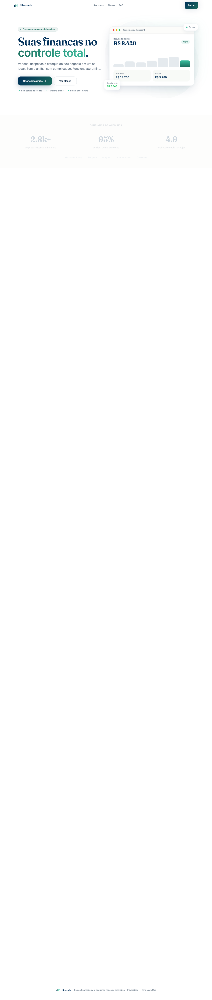
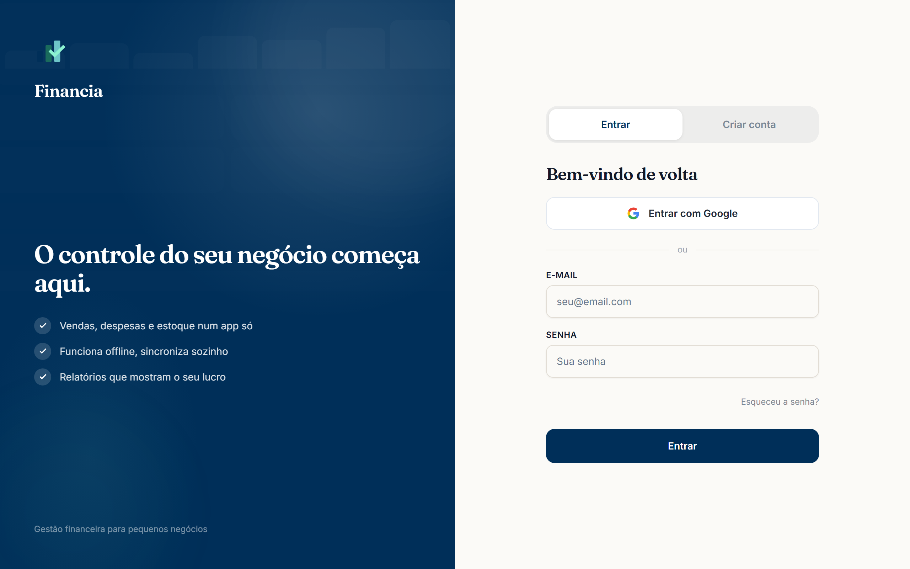
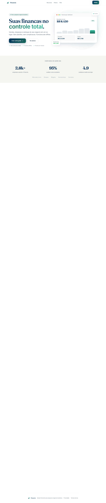
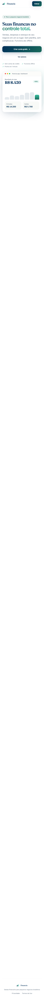
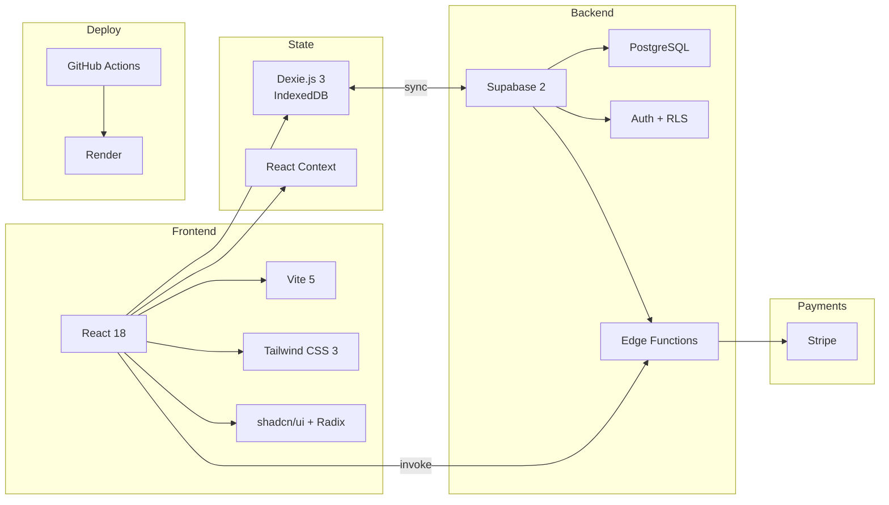
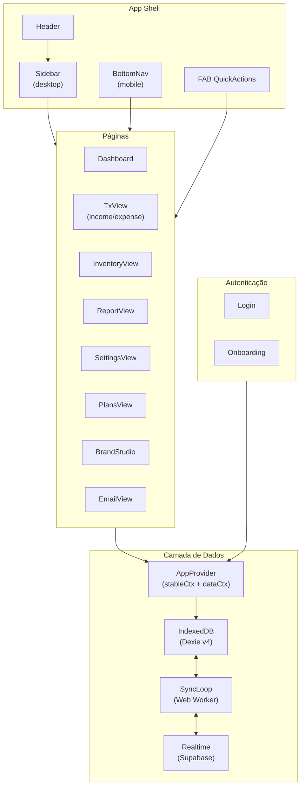
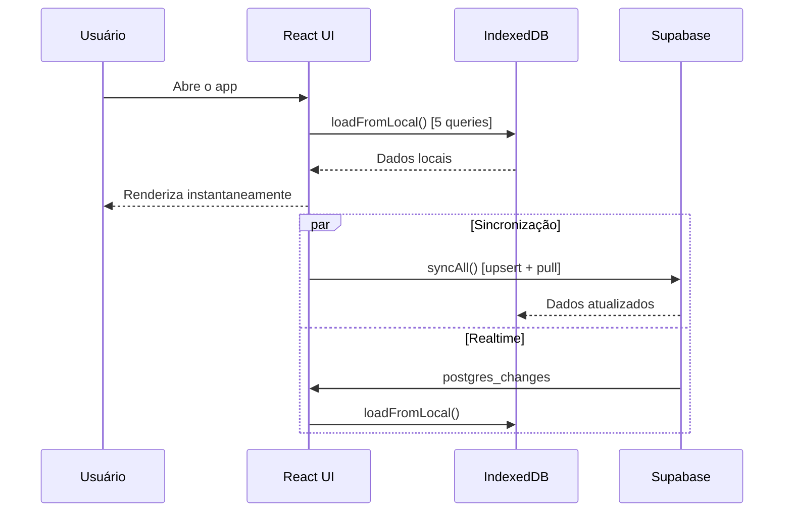
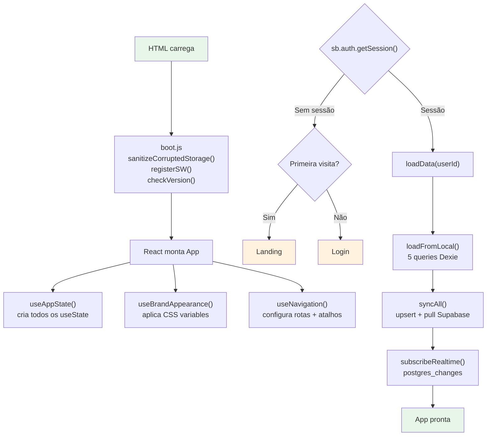
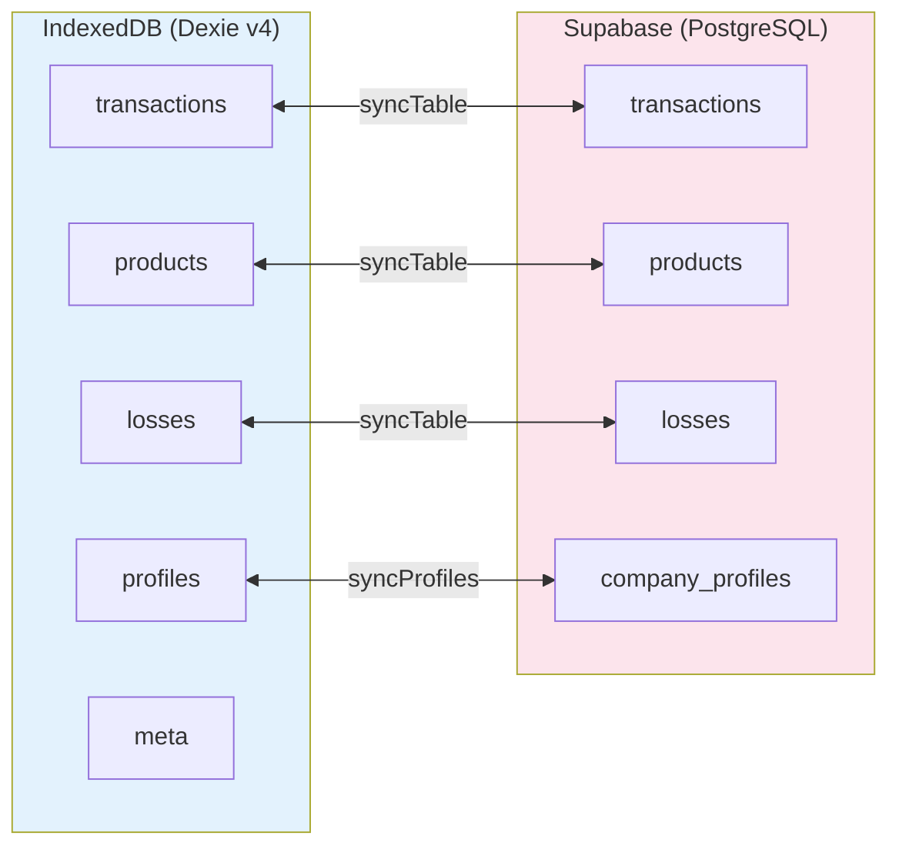
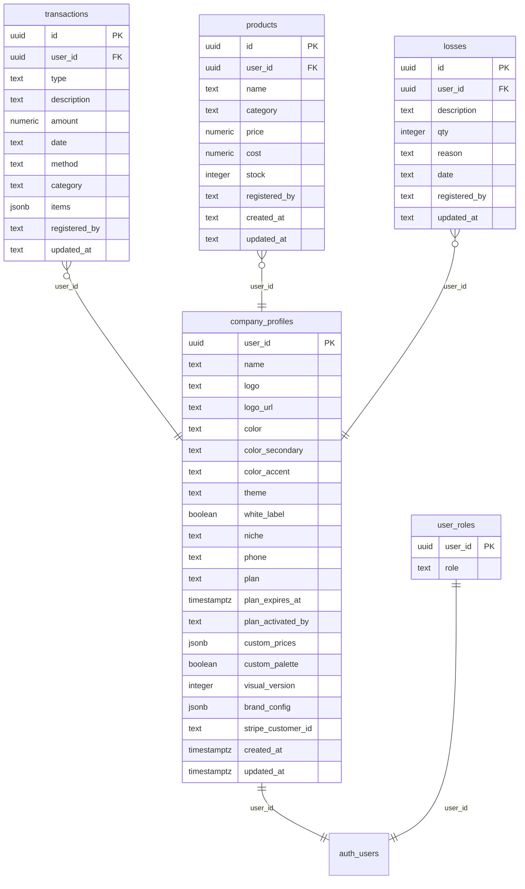

<div align="center">

#  Financia

**Gestão financeira offline-first para pequenos negócios**


[PWA](https://financiabr.me) · [Electron](https://financiabr.me) · Android TWA

---

</div>

## Visão Geral

O Financia é um sistema de gestão financeira construído para pequenos negócios que precisam registrar vendas, despesas e estoque — mesmo sem conexão com a internet. Os dados ficam salvos localmente e sincronizam automaticamente quando a conexão volta.

<div align="center">



</div>

### Funcionalidades Principais

| Recurso | Descrição |
|---------|-----------|
| **Dashboard** | KPIs, gráficos de barras, comparativo mensal, insights com IA |
| **Vendas / Ganhos** | Lista virtual com paginação, busca, filtros por período |
| **Despesas** | Registro com categorias, geração automática de recorrentes |
| **Estoque** | Produtos com preço/custo/estoque, registro de perdas |
| **Relatórios** | Resumo financeiro por período com exportação |
| **Planos** | Sistema de assinatura via Stripe (free/pro/premium) |
| **Brand Studio** | Editor de identidade visual (cores, tipografia, logo) |
| **White-label** | Cada cliente pode ter sua marca personalizada |
| **Admin** | Painel multi-clientes com impersonation e métricas |
| **Offline** | Funciona 100% offline, sincroniza quando online |
| **PWA** | Instalável no celular e desktop |
| **Dark Mode** | Tema claro/escuro com toggle |

---

## Screenshots

<div align="center">
<table>
  <tr>
    <td align="center"><b>Landing Page</b></td>
    <td align="center"><b>Login</b></td>
    <td align="center"><b>Dark Mode</b></td>
  </tr>
  <tr>
    <td></td>
    <td></td>
    <td></td>
  </tr>
  <tr>
    <td align="center"><b>Mobile</b></td>
    <td align="center"><b>Dashboard</b></td>
    <td align="center"><b>Configurações</b></td>
  </tr>
  <tr>
    <td></td>
    <td></td>
    <td></td>
  </tr>
</table>
</div>

---

## Stack Tecnológica



| Camada | Tecnologia |
|--------|-----------|
| UI | React 18, Vite 5, Tailwind CSS 3, shadcn/ui, Radix |
| State | Dexie.js 3 (IndexedDB), React Context |
| Backend | Supabase 2 (PostgreSQL, Auth, RLS, Edge Functions) |
| Pagamentos | Stripe (checkout, assinatura, webhooks) |
| Desktop | Electron 31 |
| Mobile | Android TWA (WebView) |
| Testes | Vitest 4, Testing Library, Playwright |
| CI/CD | GitHub Actions → Render (auto-deploy) |

---

## Arquitetura

### Estrutura de Diretórios

```
src/
├── features/              # Módulos de domínio
│   ├── auth/              # Login, signup, sessão, impersonation
│   ├── branding/          # Brand Studio (editor visual)
│   ├── dashboard/         # KPIs, gráficos, resumo
│   ├── email/             # Comunicação (templates)
│   ├── inventory/         # Produtos e perdas
│   ├── landing/           # Landing page pública
│   ├── plans/             # Planos e assinatura
│   ├── reports/           # Relatórios financeiros
│   ├── settings/          # Configurações
│   └── transactions/      # Vendas, ganhos, despesas
├── shared/                # Código compartilhado
│   ├── hooks/             # useDataLoader, useSyncLoop, useRealtime
│   └── ui/                # Sidebar, BottomNav, Header, Toast, etc.
├── lib/                   # Utilitários, serviços (Dexie, Supabase, auth)
├── hooks/                 # useAppState, useNavigation, useSyncLeader
├── routes/                # Definição de rotas (routes.jsx)
├── workers/               # sync.worker.js (Web Worker)
├── App/                   # App.jsx, contextos, LazyPage
├── core/                  # boot.js (inicialização)
└── test/                  # Setup de testes, mocks
```

### Diagrama de Componentes



### Fluxo de Dados



---

## Ciclo de Vida da Aplicação



---

## Roteamento

| Rota | Componente | Descrição |
|------|-----------|-----------|
| `/` | `Dashboard` | KPIs, gráficos, resumo financeiro |
| `/income` | `TxView` | Vendas e ganhos (lista virtual) |
| `/expense` | `TxView` | Despesas |
| `/inventory` | `InventoryView` | Produtos e perdas |
| `/report` | `ReportView` | Relatórios financeiros |
| `/settings` | `SettingsView` | Configurações |
| `/planos` | `PlansView` | Planos e assinatura |
| `/brandstudio` | `BrandStudio` | Editor de identidade visual |
| `/email` | `EmailView` | Comunicação (admin only) |

**Atalhos de teclado:** `g+d` Dashboard · `g+t` Transações · `g+i` Estoque · `g+s` Config · `g+r` Relatório · `g+p` Planos

---

## Sincronização Offline-First



**Mecanismos de sincronização:**

| Trigger | Intervalo | Descrição |
|---------|-----------|-----------|
| `setInterval` | 120s | Sync periódico no Web Worker |
| `visibilitychange` | Ao voltar à aba | Sync quando a aba fica visível |
| `online` | Ao reconectar | Sync imediato ao voltar online |
| `postgres_changes` | Tempo real | Supabase Realtime → debounce 2s |
| `BroadcastChannel` | Contínuo | Leader election → 1 aba sincroniza |

**Campos de controle por registro:**
- `_synced`: `0` = alterado localmente, `1` = sincronizado
- `_deleted`: `0` = ativo, `1` = soft-deleted
- `_updated_at`: timestamp da última atualização

---

## Banco de Dados

### Tabelas



### Funções RPC (SECURITY DEFINER)

| Função | Chamada por | Descrição |
|--------|-------------|-----------|
| `set_client_plan` | admin / Stripe webhook | Ativa/rebaixa plano |
| `set_white_label` | service_role | Liga/desliga white-label |
| `admin_delete_client` | admin | Deleta cliente + auth.users |
| `admin_get_magic_link` | admin | Gera magic link |
| `admin_set_custom_price` | admin | Define preço customizado |
| `admin_client_usage` | admin | Métricas de uso |
| `admin_db_stats` | admin | Estatísticas do banco |
| `admin_impersonate_start` | admin | Assume identidade de cliente |
| `handle_new_user` | auth trigger | Cria profile + role no signup |

### Edge Functions (Deno)

| Função | Descrição |
|--------|-----------|
| `stripe-webhook` | Processa eventos de pagamento |
| `create-payment` | Cria sessão Stripe |
| `create-subscription` | Cria assinatura recorrente |
| `cancel-subscription` | Cancela assinatura |
| `get-subscription-status` | Status da assinatura |
| `admin-create-client` | Cria novo cliente |
| `admin-stripe-overview` | Visão geral de cobranças |
| `ai` | Análise financeira com IA |
| `trigger-apk-build` | Dispara build de APK |
| `send-custom-email` | Envia email personalizado |

### Segurança

- **RLS:** todas as tabelas com Row Level Security habilitado
- **SECURITY DEFINER:** funções admin exigem `role='admin'` via padrão seguro
- **White label guard:** trigger reverte mudanças não autorizadas
- **Plan guard:** trigger impede mudança sem GUC `app.allow_plan_change`
- **Soft delete:** registros mantidos com `_deleted=1`

---

## Plano e Limites

| Plano | Transações | Produtos | Perdas |
|-------|-----------|----------|--------|
| **free** | 50 | 20 | 10 |
| **pro** | ∞ | ∞ | ∞ |
| **premium** | ∞ | ∞ | ∞ |

Upgrade via Stripe → webhook → `set_client_plan()` (SECURITY DEFINER).
Downgrade automático: plano expirado cai para free.

---

## Comandos

```bash
npm run dev           # http://localhost:5173
npm test              # Vitest (1178+ testes)
npm run test:coverage # Cobertura
npm run lint          # ESLint
npm run typecheck     # TypeScript
npm run build         # Build de produção
npm run check         # lint + typecheck + test
```

---

## Setup

1. `npm install`
2. Copie `.env.example` para `.env` e preencha:
   - `VITE_SUPABASE_URL` e `VITE_SUPABASE_ANON_KEY`
   - `VITE_STRIPE_PUBLISHABLE_KEY`
   - `VITE_APP_URL`
3. Para Supabase local: `npx supabase start` (requer Docker)
4. `npm run dev`

---

## PWA

- **Service Worker:** Workbox via `vite-plugin-pwa` (injectManifest), fonte `src/sw.ts` → `dist/sw.js`; precache, cache-first assets, network-first API/Supabase, background sync p/ mutations offline
- **Manifest:** gerado pelo plugin (`manifest.webmanifest`), `standalone`, theme `#002f59`, locale `pt-BR`
- **Offline:** Dexie IndexedDB armazena tudo localmente
- **Install:** captura `beforeinstallprompt`

---

## License

Proprietário. Uso não autorizado é proibido.
