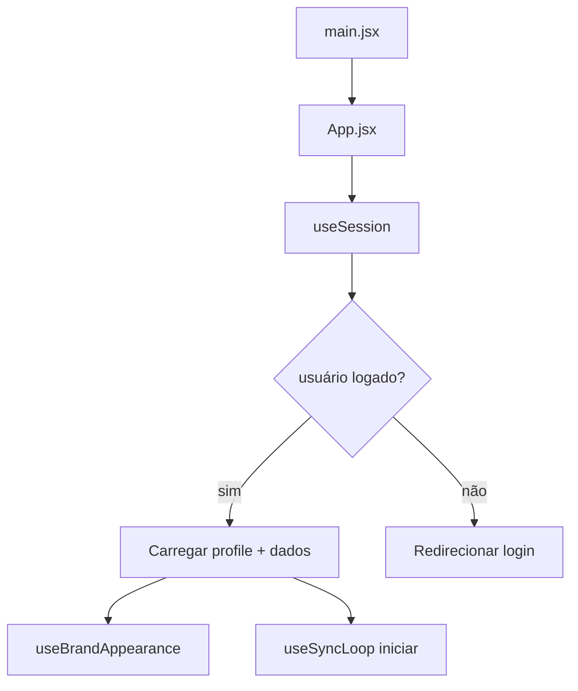
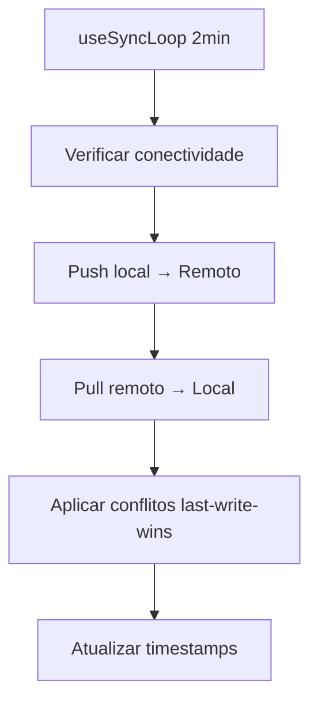
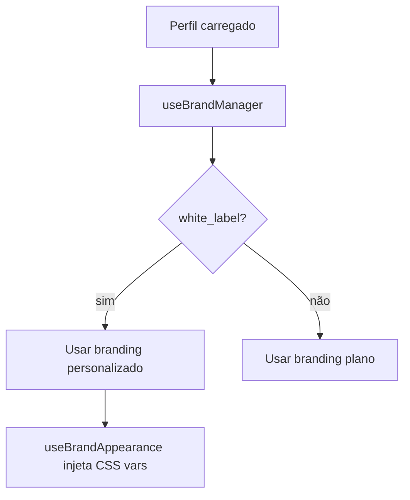

# 02_FRONTEND_ARCHITECTURE — FINANCIA

## Objetivo
- **Propósito**: Documentar a arquitetura frontend completa do Financia, incluindo estrutura de componentes, gerenciamento de estado, rotas e integrações
- **Escopo**: React 18 + Vite 5 + Tailwind CSS + Dexie.js + Hash Router + View Transitions API
- **Público-alvo**: Arquitetos frontend, engenheiros frontend, engenheiros UI/UX
- **Impacto de negócio**: Base para white-label, escalabilidade e performance

## Scope
Frontend completo com foco em:
- Offline-first via IndexedDB
- White-label dinâmico
- Transições nativas de navegação
- Integração com backend via hooks

## Current State
### Estrutura de Arquivos
```
src/
├── App.jsx                          # Componente raiz com gerenciamento de estado
├── main.jsx                         # Ponto de entrada
├── lib/
│   ├── db.js                        # IndexedDB (Dexie.js)
│   ├── supabase.js                  # Cliente Supabase
│   ├── auth.js                      # Autenticação
│   ├── constants.js                 # Constantes da aplicação
│   ├── utils.js                     # Utilitários
│   ├── stripe.js                    # Integração Stripe
│   └── aiClient.js                  # Cliente AI unificado
├── hooks/
│   ├── useSession.js                # Auth + impersonificação
│   ├── useBrandAppearance.js        # Injeção de tema CSS
│   ├── useBrandManager.js           # Gerenciamento de branding
│   ├── useTx.js                     # CRUD transações
│   ├── useProducts.js               # CRUD produtos
│   ├── useLosses.js                 # CRUD perdas
│   ├── useDataLoader.js             # Carregamento assíncrono
│   ├── useSyncLoop.js               # Sincronização background
│   ├── useRealtime.js               # Escuta em tempo real
│   └── useStripeCheckoutInit.js     # Checkout de pagamento
├── views/
│   ├── Dashboard.jsx
│   ├── IncomePage.jsx
│   ├── ExpensePage.jsx
│   ├── InventoryPage.jsx
│   ├── Settings.jsx
│   └── Planos.jsx
├── components/
│   ├── Sidebar.jsx
│   ├── Header.jsx
│   ├── BottomNav.jsx
│   └── ui/                            # Componentes shadcn/ui
└── design-system/
    ├── colors.css
    ├── typography.css
    ├── spacing.css
    └── shadows.css
```

### Stack Técnica
| Camada | Tecnologia | Versão |
|--------|-----------|--------|
| Framework | React | 18 |
| Build | Vite | 5 |
| Estilização | Tailwind CSS | 3 |
| Estado | Zustand | (local) |
| Armazenamento Offline | Dexie.js | 3 |
| Roteamento | Hash Router | nativo |
| Animações | View Transitions API | nativo |

## Problems Found
1. **Estado disperso**: 7-8 useState em Vendas.jsx e Orcamentos.jsx precisam de useReducer
2. **Supabase direto nas páginas**: Violação do padrão services/
3. **Console.log em produção**: Presente em hooks de sincronização
4. **Keys de index em listas**: React warnings em componentes de lista

## Architecture Decisions
| Decisão | Justificativa | Status |
|---------|--------------|--------|
| Hash Router | Compatibilidade com arquivos estáticos | Aprovado |
| View Transitions API | Transições nativas, sem bibliotecas | Aprovado |
| Dexie.js como fonte de verdade | Offline-first, push-based sync | Aprovado |
| Zustand local | Simples, sem dependência externa | Aprovado |
| Tema via CSS variables | Performance, injeção dinâmica | Aprovado |

## Flows
### 1. Fluxo de Inicialização


### 2. Fluxo de Sincronização


### 3. Fluxo de Branding


## Structure
### Component Tree
```
App
├── Sidebar (condicional)
├── Header (condicional)
├── Routes
│   ├── Dashboard
│   ├── IncomePage
│   ├── ExpensePage
│   ├── InventoryPage
│   ├── Settings
│   └── Planos
└── BottomNav (mobile)
```

### Padrão de Hooks
```javascript
// Padronizado: use[Feature].js
// Retorna: { data, loading, error, actions }
export function useTx(userId) {
  const [txs, setTxs] = useState([]);
  const [loading, setLoading] = useState(true);
  
  const loadTxs = useCallback(async () => {
    // carregar do IndexedDB
  }, [userId]);
  
  const addTx = async (tx) => {
    // adicionar local + marcar para sync
  };
  
  return { txs, loading, addTx, updateTx, removeTx };
}
```

## Dependencies
### Runtime
- React 18
- ReactDOM 18
- Dexie 3.x
- Supabase JS 2.x

### Build
- Vite 5.x
- Tailwind CSS 3.x
- ESLint 8.x
- Prettier 3.x

### Desenvolvimento
- Vitest (testes)
- Playwright (e2e)
- Husky (hooks git)

## Risks
| Risco | Impacto | Mitigação |
|-------|---------|-----------|
| Sync conflitos | Perda de dados | Last-write-wins + logs |
| Tema quebrado | UI inconsistente | CSS vars validação |
| Console.log | Performance | Remover antes do build |
| Index keys | Re-renders | Usar ID único |

## Approval Criteria
- [ ]Lint passando (`npm run lint`)
- [ ]Console.log removido
- [ ]Keys de index corrigidas
- [ ]Hooks migrados para useReducer
- [ ]Supabase apenas via services/

## Future Evolution
- **Próximo**: Migrar para TanStack Query para cache server-state
- **Planejado**: Micro-frontends para módulos
- **Considerar**: React Server Components para dashboard