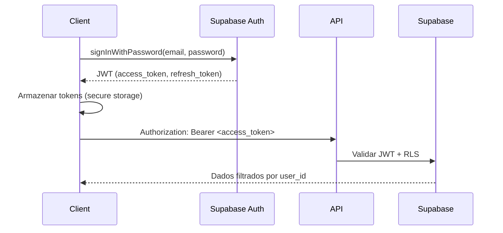
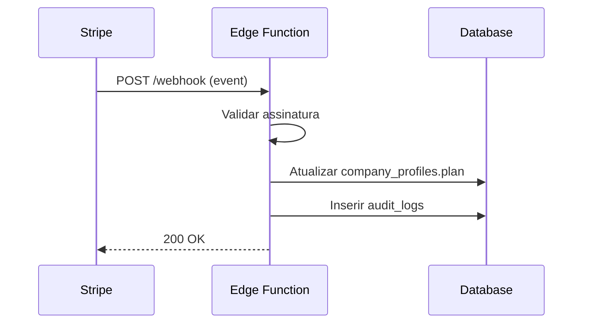

# 03_BACKEND_ARCHITECTURE — FINANCIA

## Objetivo
- **Propósito**: Documentar a arquitetura backend completa do Financia baseada em Supabase (PostgreSQL + Auth + Edge Functions)
- **Escopo**: Banco de dados, autenticação, RLS, Edge Functions, Storage, Realtime
- **Público-alvo**: Arquitetos backend, DBAs, engenheiros DevOps, equipe de segurança
- **Impacto de negócio**: Base para multi-tenancy, white-label, escalabilidade e conformidade

## Scope
Backend completo Supabase:
- PostgreSQL 17 com RLS
- Supabase Auth (JWT)
- Edge Functions (Deno)
- Realtime subscriptions
- Supabase Storage

## Current State
### Tabelas Principais
```sql
-- Perfis de empresa (multi-tenancy)
company_profiles (
  user_id uuid PK,
  name text,
  email text,
  white_label boolean,
  plan text,           -- 'free', 'pro', 'premium', 'white_label'
  custom_price_cents integer,
  visual_version integer,
  color, color_secondary, color_accent text,
  logo_url text,
  theme text           -- 'light', 'dark'
)

-- Transações financeiras
transactions (
  id uuid PK,
  user_id uuid FK,
  type text,           -- 'income', 'expense'
  description text,
  amount numeric(10,2),
  date date,
  method text,
  _synced boolean,
  _updated_at timestamptz,
  _deleted boolean
)

-- Produtos/Inventário
products (
  id uuid PK,
  user_id uuid FK,
  name text,
  category text,
  price numeric(10,2),
  stock integer,
  _synced boolean,
  _updated_at timestamptz,
  _deleted boolean
)

-- Perdas
losses (
  id uuid PK,
  user_id uuid FK,
  description text,
  qty integer,
  reason text,
  date date,
  _synced boolean,
  _updated_at timestamptz,
  _deleted boolean
)

-- Logs de auditoria
audit_logs (
  id uuid PK,
  user_id uuid,
  action text,
  table_name text,
  record_id uuid,
  old_data jsonb,
  new_data jsonb,
  created_at timestamptz
)
```

### Edge Functions
```
supabase/functions/
├── create-subscription/     # Criar assinatura Stripe
├── cancel-subscription/     # Cancelar assinatura
├── create-payment/          # Criar pagamento
├── webhook/                 # Webhook Stripe
├── ai-assistant/            # Assistente AI
└── brand-preview/           # Preview white-label
```

## Problems Found
1. **RLS policies não cobrem todas as tabelas**: company_profiles tem gaps
2. **Edge Functions sem rate limiting**: Vulneráveis a abuso
3. **Auth refresh automático**: Não tratado em todos os casos
4. **Logs de auditoria incompletos**: Nem todas as operações auditadas

## Architecture Decisions
| Decisão | Justificativa | Status |
|---------|--------------|--------|
| PostgreSQL + RLS | Segurança nativa, multi-tenancy | Aprovado |
| JWT via Supabase Auth | Zero-config, renovação automática | Aprovado |
| Edge Functions Deno | TypeScript nativo, cold start baixo | Aprovado |
| Push-based sync | Offline-first, controle do usuário | Aprovado |
| Last-write-wins | Simplicidade, sem conflitos complexos | Aprovado |

## Flows
### 1. Autenticação e Sessão


### 2. Sincronização Push-Based
```mermaid
flowchart TD
    A[Cliente offline] --> B[Escreve no IndexedDB]
    B --> C[_synced = false]
    C --> D[Online detectado]
    D --> E[useSyncLoop push]
    E --> F[Upsert no Supabase]
    F --> G[_synced = true]
    G --> H[_updated_at = now()]
```

### 3. Edge Function - Webhook Stripe


## Structure
### Padrão Edge Function
```typescript
// supabase/functions/<nome>/index.ts
import { serve } from "https://deno.land/std@0.168.0/http/server.ts"
import { createClient } from "https://esm.sh/@supabase/supabase-js@2"

serve(async (req: Request) => {
  // 1. Validar JWT
  const authHeader = req.headers.get("Authorization")
  if (!authHeader) return new Response("Unauthorized", { status: 401 })
  
  const supabase = createClient(
    Deno.env.get("SUPABASE_URL")!,
    Deno.env.get("SUPABASE_ANON_KEY")!,
    { global: { headers: { Authorization: authHeader } } }
  )
  
  const { data: { user } } = await supabase.auth.getUser()
  if (!user) return new Response("Unauthorized", { status: 401 })
  
  // 2. Processar request
  const body = await req.json()
  
  // 3. Verificar permissão (RLS + lógica extra)
  const { data: profile } = await supabase
    .from("company_profiles")
    .select("plan, white_label")
    .eq("user_id", user.id)
    .single()
  
  if (!profile) return new Response("Not found", { status: 404 })
  
  // 4. Executar lógica de negócio
  // ...
  
  // 5. Auditoria
  await supabase.from("audit_logs").insert({
    user_id: user.id,
    action: "<action>",
    table_name: "<table>",
    record_id: "<id>",
    new_data: body
  })
  
  return new Response(JSON.stringify({ success: true }), {
    headers: { "Content-Type": "application/json" }
  })
})
```

## Dependencies
### Supabase Services
| Serviço | Uso |
|---------|-----|
| Postgres | Dados relacionais + RLS |
| Auth | JWT, OAuth, MFA |
| Realtime | Subscrições WebSocket |
| Storage | Arquivos (logos, comprovantes) |
| Edge Functions | Lógica serverless Deno |

### Externas
- Stripe (pagamentos)
- OpenAI/Anthropic (AI)

## Risks
| Risco | Impacto | Mitigação |
|-------|---------|-----------|
| RLS bypass | Vazamento de dados | Testes automatizados RLS |
| Edge Function timeout | Falha silenciosa | Timeout 30s + retry logic |
| Rate limiting | Abuso/DDoS | Supabase built-in + custom |
| Schema drift | Incompatibilidade | Migrações versionadas |

## Approval Criteria
- [ ] RLS em 100% das tabelas de dados
- [ ] Edge Functions com validação JWT
- [ ] Audit logs em todas operações críticas
- [ ] Rate limiting implementado
- [ ] Testes de integração passando

## Future Evolution
- **Próximo**: Migrar RPCs para PostgREST
- **Planejado**: GraphQL wrapper para queries complexas
- **Considerar**: Row-level encryption para dados sensíveis