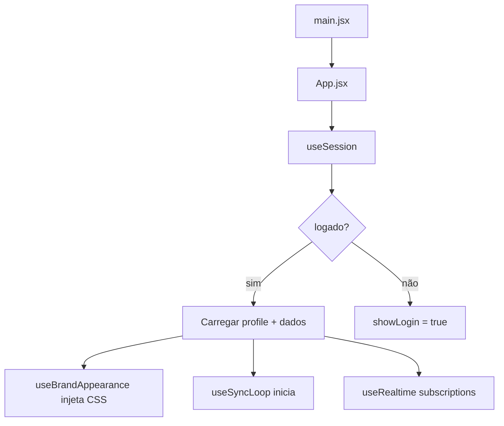
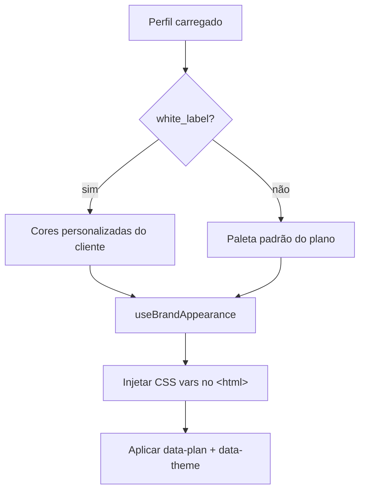

# MASTER.md

# Arquitetura Mestre — Documentação Técnica

## Objetivo
- **Propósito**: Visão consolidada da arquitetura completa do Financia, descrevendo componentes, fluxos de dados e interações entre frontend, backend, banco de dados e serviços externos
- **Escopo**: Design completo do sistema, incluindo arquitetura técnica, padrões, fluxos de dados e componentes principais
- **Público-alvo**: Arquitetos de software, engenheiros de desenvolvimento de sistemas, equipes técnicas seniores
- **Impacto de negócio**: Estabelece a base arquitetural para escalabilidade, portabilidade offline e transformação de white-label

---

## 1. VISÃO GERAL E STACK

O Financia é um aplicativo *white-label* de gestão financeira para pequenas empresas, projetado **offline-first** (funciona sem conexão) e disponível como PWA, APK Android (WebView) ou executável Windows (Electron).

| Camada | Tecnologia | Versão | Notas |
| :--- | :--- | :--- | :--- |
| **Frontend** | React + Vite | 18.3 + 5.4 | Roteamento por hash, views lazy-loaded |
| **Estilos** | Tailwind CSS + CSS Variables | v3 | Tema dinâmico via variáveis CSS injetadas |
| **Backend** | Supabase (PostgreSQL) | 17 + Auth + RLS + Edge Functions | Toda lógica serverless em Deno |
| **Offline** | Dexie.js (IndexedDB) | 3.2.7 | Banco local com sincronização push-based |
| **Desktop** | Electron | 31 | Carrega URL de produção via `electron/main.cjs` |
| **Deploy** | Render | — | Static Site com auto-deploy no push para `main` |
| **CI/CD** | GitHub Actions | — | Compilação automática de APK Android e EXE Windows |
| **Cobrança** | Stripe | — | Stripe Elements + Edge Functions para assinaturas |
| **Testes** | Vitest + Testing Library | — | Testes unitários e de integração |

### Estrutura de Diretórios

```
src/
├── App.jsx                    # Componente raiz: estado, roteamento, layout
├── main.jsx                   # Ponto de entrada
├── lib/                       # Código JS puro (DB, APIs, utilitários)
│   ├── db.js                  # Dexie + sincronização push-based
│   ├── supabase.js            # Cliente Supabase
│   ├── auth.js                # Login, logout, reset de senha
│   ├── constants.js           # Limites de plano, presets de cores, menus
│   ├── utils.js               # Formatação numérica, cores, datas
│   ├── stripe.js              # Utilitários Stripe
│   ├── aiClient.js            # Cliente AI
│   ├── recurring.js           # Processador de lançamentos recorrentes
│   ├── exporters.js           # Exportação CSV/JSON
│   ├── crud.js                # Métodos auxiliares de Dexie
│   └── pwa.js                 # Registro do Service Worker
├── hooks/                     # Hooks customizados
│   ├── useSession.js          # Auth + impersonação + loadData
│   ├── useBrandAppearance.js  # Injeção de variáveis CSS
│   ├── useBrandManager.js     # Atualização de branding
│   ├── useTx.js               # CRUD transações
│   ├── useProducts.js         # CRUD produtos
│   ├── useLosses.js           # CRUD perdas
│   ├── useDataLoader.js       # Carregamento assíncrono de dados
│   ├── useSyncLoop.js         # Loop de sincronização a cada 2min
│   ├── useRealtime.js         # Subscrições Realtime Supabase
│   ├── useAuthBootstrap.js    # onAuthStateChange listener
│   ├── useImpersonation.js    # Fluxo de impersonação admin
│   └── useStripeCheckoutInit.js # Checkout Stripe
├── views/                     # Telas (lazy-loaded via React.lazy)
│   ├── Login.jsx
│   ├── Landing.jsx
│   ├── Dashboard.jsx
│   ├── TxView.jsx             # Income + Expense
│   ├── InventoryView.jsx
│   ├── ReportView.jsx
│   ├── EmailView.jsx
│   ├── SettingsView.jsx
│   ├── PlansView.jsx
│   ├── PrivacyPolicy.jsx
│   ├── TermsOfService.jsx
│   └── BrandStudioView.jsx
├── components/                # Componentes reutilizáveis
│   ├── Sidebar.jsx
│   ├── Header.jsx
│   ├── BottomNav.jsx
│   ├── Toast.jsx, Confirm.jsx, Offline.jsx, SyncBadge.jsx
│   ├── UpgradeModal.jsx, Onboarding.jsx, UpdateBanner.jsx
│   └── ui/[Button, Input, Card, Badge, etc].jsx
├── admin/                     # Painel do administrador
│   ├── AdminPanel.jsx
│   ├── ClientEditModal.jsx
│   └── GhTokenCard.jsx
├── brandStudio/               # Editor de identidade visual (20+ arquivos)
│   ├── BrandStudioView.jsx
│   ├── BrandGlobalEditor.jsx
│   ├── schema.js, presets.js, normalizer.js
│   └── ... (22 arquivos no total)
├── design-system/             # Tokens visuais
│   ├── colors.css, typography.css
│   ├── spacing.css, shadows.css, borderRadius.css
├── context/                   # Contextos React (pouco usado)
└── test/                      # Testes
supabase/
├── functions/                 # Edge Functions Deno (15 funções)
│   ├── create-subscription/
│   ├── cancel-subscription/
│   ├── stripe-webhook/
│   ├── ai/                    # Assistente AI
│   └── admin-*/               # Funções administrativas
└── migrations/                # Migrações SQL (20 arquivos)
environments/
├── .env.development.local
├── .env.staging
└── .env.production
```

---

## 2. ARQUITETURA FRONTEND

### Roteamento
- **Hash routing**: `window.location.hash` monitorado manualmente
- **11 views lazy-loaded** via `React.lazy` + `Suspense`
- **View Transitions API**: Animação nativa de transição entre telas
- Rotas autenticadas: `#dashboard`, `#income`, `#expense`, `#inventory`, `#email`, `#report`, `#settings`, `#planos`, `#brandstudio`
- Rotas públicas: `#landing`, `#privacidade`, `#termos`

### Gerenciamento de Estado
- **Centralizado no App.jsx**: ~18 `useState` + `useReducer` para dados
- **Sem biblioteca externa** (Zustand mencionado em docs mas não implementado)
- Estado distribuído para views via props
- `React.memo` em Sidebar, Header, BottomNav
- `React.lazy` em todas as views para code-splitting

### Hooks de Dados
Cada hook segue o padrão: `{ data, loading, error, actions }`

| Hook | Tabela | Operações |
|------|--------|-----------|
| `useTx` | transactions | CRUD + filtro por tipo/intervalo |
| `useProducts` | products | CRUD + ajuste de estoque |
| `useLosses` | losses | CRUD |
| `useSession` | company_profiles | Auth + loadData + saveBrand + savePhone |
| `useBrandManager` | company_profiles | Atualização de branding |
| `useDataLoader` | — | Carregamento assíncrono de todas as tabelas |

---

## 3. BANCO DE DADOS E OFFLINE-FIRST

### Tabelas (Dexie + Supabase)

| Tabela | Índices | Propósito |
|--------|---------|-----------|
| `transactions` | id, user_id, date, updated_at | Receitas e despesas |
| `products` | id, user_id, category, updated_at | Inventário |
| `losses` | id, user_id, date, updated_at | Perdas |
| `profiles` | user_id, updated_at | Dados da empresa + branding |
| `meta` | key | Metadados de sincronização |

### Sincronização (Push-Based)
- **Fonte da verdade de gravação**: IndexedDB (Dexie) — escreve local primeiro
- **Push**: A cada 2 minutos, envia alterações locais não sincronizadas para o Supabase
- **Pull**: Busca alterações remotas desde o último sync
- **Resolução de conflitos**: Last-write-wins com viés local
- **Retry**: Até 3 tentativas, com delay de 30s em rate limit
- **Cleanup**: Remove do Dexie linhas sincronizadas que não existem mais na nuvem

### Supabase Tabelas
```sql
company_profiles (user_id PK, name, email, plan, white_label, color, color_secondary, color_accent, ...)
transactions (id PK, user_id FK, type, description, amount, date, method, _synced, _deleted, _updated_at)
products (id PK, user_id FK, name, category, price, stock, _synced, _deleted, _updated_at)
losses (id PK, user_id FK, description, qty, reason, date, _synced, _deleted, _updated_at)
```

---

## 4. BACKEND (SUPABASE)

### Edge Functions (15 funções)
- **Assinaturas**: `create-subscription`, `cancel-subscription`, `get-subscription-status`
- **Pagamentos**: `create-payment`, `create-setup-intent`, `set-default-payment-method`, `get-payment-method`, `remove-payment-method`
- **Webhooks**: `stripe-webhook` (processa eventos de faturamento)
- **Admin**: `admin-create-client`, `admin-set-custom-price`, `admin-set-white-label`, `admin-stripe-overview`
- **AI**: `ai` (assistente)
- **Config**: `stripe-config`

### RLS (Row Level Security)
- Tabelas de negócio: `auth.uid() = user_id`
- `company_profiles`: Política `update_own_branding_only` + trigger `prevent_plan_change`
- Contexto `app.allow_plan_change` para operações administrativas
- Trigger `guard_white_label()`: Protege campo `white_label`
- Trigger `handle_new_user()`: Cria perfil automaticamente

### Autenticação
- Supabase Auth (email + senha)
- JWT com renovação automática
- Impersonação admin via RPC `admin_impersonate_start` + tokens temporários

---

## 5. GAPS IDENTIFICADOS: DOCUMENTAÇÃO vs. CÓDIGO vs. VISÃO

### Problemas Graves

| # | Problema | Severidade | Detalhes |
|---|---------|-----------|----------|
| 1 | **Docs contradizem implementação** | **Crítico** | `ARCHITECTURE.md` cita Zustand como state manager, mas `package.json` não tem Zustand. Código usa `useState` puro. |
| 2 | **Docs múltiplos com mesmo propósito** | **Alto** | 3 documentos descrevem a arquitetura geral: `docs/ARCHITECTURE.md`, `docs/ARCHITECTURE/MASTER.md`, `docs/ARCHITECTURE/FRONTEND.md`. Conteúdos conflitam entre si. |
| 3 | **01_PRODUCT_VISION.md descreve app diferente** | **Alto** | Visão diz "2 telas" (TxEntry, Inventory, Admin), código tem 11 views. Visão diz "remover BrandStudio", código tem 22 arquivos. Visão diz "remover Email", `EmailView.jsx` existe. Visão diz "remover impersonation", hook + 4 migrations implementam. |
| 4 | **Docs aspiracionais como se fossem reais** | **Alto** | `06_DATABASE_ARCHITECTURE.md`, `07_OFFLINE_ARCHITECTURE.md`, `10_PERFORMANCE_ARCHITECTURE.md`, `12_CI_CD.md` descrevem estados planejados/futuros como se já estivessem implementados. |
| 5 | **28+ arquivos em docs/ para projeto de 4 tabelas** | **Médio** | Superdocumentação para um app pequeno. `docs/ai/` com 6 arquivos, `TEMPLATES/` com 4 templates, múltiplos duplicates. |

### Problemas de Documentação

| # | Arquivo | Problema |
|---|---------|----------|
| 1 | `docs/ARCHITECTURE/MASTER.md` | Descreve Zustand (não existe), diagrama corrompido (linhas 58-67 ilegíveis), lista `src/lib/constants.js` 5x |
| 2 | `docs/ARCHITECTURE.md` | Descreve Zustand, contradiz MASTER.md na estrutura de sincronização |
| 3 | `docs/ARCHITECTURE/FRONTEND.md` | Duplicata de `02_FRONTEND_ARCHITECTURE.md` com conteúdo conflitante |
| 4 | `docs/ARCHITECTURE/PRODUCT_VISION.md` | Duplicata de `01_PRODUCT_VISION.md` |
| 5 | `04_DESIGN_SYSTEM.md` | Sistema de design completo (326 linhas) mas não reflete o que está em `src/design-system/` (apenas 5 CSS tokens) |
| 6 | `01_PRODUCT_VISION.md` | Mistura visão de produto (primeira metade) com spec técnica de white-label (segunda metade). Conteúdo futuro, não atual. |
| 7 | `CLAUDE.md` e `docs/AI_CONTEXT.md` | Regras de código duplicadas entre raiz e docs/ |

---

## 6. RECOMENDAÇÕES: O QUE FAZER

### Ação Imediata: Unificar Documentação
1. **Eliminar duplicatas**: Manter `docs/ARCHITECTURE.md` como arquivo único de arquitetura. Remover `MASTER.md`, `FRONTEND.md`, `PRODUCT_VISION.md` de `docs/ARCHITECTURE/`.
2. **Consolidar docs aspiracionais**: `06_DATABASE_ARCHITECTURE.md`, `07_OFFLINE_ARCHITECTURE.md`, `10_PERFORMANCE_ARCHITECTURE.md`, `12_CI_CD.md` devem ser arquivados em `docs/archive/` até que a simplificação seja implementada.
3. **Unificar regras de IA**: Remover `docs/AI_CONTEXT.md`, manter apenas `CLAUDE.md` na raiz.
4. **Consolidar docs AI**: `docs/ai/` (6 arquivos) → 1 arquivo `docs/AI.md`.
5. **Remover `docs/TEMPLATES/`**: Templates genéricos sem uso.

### Decisões de Arquitetura (Implementação)

| Decisão | Opção | Justificativa |
|---------|-------|--------------|
| State management | Manter `useState` no App.jsx | App pequeno (4 tabelas). Estado global cabe em ~18 states. Introduzir Zustand agora adiciona complexidade sem benefício mensurável. Se o App crescer, migrar para Zustand depois. |
| BrandStudio (22 arquivos) | Remover | Visão do produto diz "excluir". Editor visual de 22 arquivos é overengineering para app de 4 tabelas. Substituir por formulário simples em SettingsView. |
| Impersonation | Remover | Visão do produto diz "excluir". Complexidade desnecessária para admin de pequenas empresas. Admin pode acessar dados do cliente via RLS + RPCs. |
| EmailView | Remover | Visão do produto diz "excluir". Funcionalidade de email não é core para app financeiro. |
| 3 planos (free/pro/premium) | Simplificar para free/pro | Visão do produto diz "apenas free vs Pro + white-label". Premium adiciona complexidade sem receita significativa. |
| 11 views | Reduzir para 6 | Manter: Login, Landing, Dashboard, TxView, InventoryView, SettingsView (fundir Report). Remover: EmailView, PlansView (fundir em Settings), BrandStudioView, PrivacyPolicy, TermsOfService (manter como rotas estáticas simples). |
| Sync (push/pull com orphan cleanup) | Simplificar para push-only | Visão do produto + `07_OFFLINE_ARCHITECTURE.md` já recomendam. Remover pull, orphan cleanup. Simplificar `db.js` de 248 linhas para ~100. |

### Roadmap de Refatoração

| Fase | O quê | Prioridade | Risco | Dependências |
|------|-------|-----------|-------|-------------|
| 1 | **Consolidar documentação** | Alta | Baixo | Nenhuma |
| 2 | **Remover BrandStudio** (22 arquivos) | Alta | Médio | SettingsView existir para substituir |
| 3 | **Simplificar sync para push-only** | Alta | Alto | Testes existentes |
| 4 | **Remover EmailView** | Média | Baixo | Nenhuma |
| 5 | **Simplificar planos: free/pro** | Média | Alto | Stripe Edge Functions |
| 6 | **Remover impersonation** | Média | Médio | AdminPanel alternativo |
| 7 | **Reduzir views de 11 para 6** | Média | Médio | Depende das remoções anteriores |
| 8 | **Simplificar App.jsx state** | Baixa | Baixo | Depende das simplificações anteriores |

---

## 7. FLUXOS PRINCIPAIS

### Inicialização do App


### Sincronização
```mermaid
flowchart TD
    A[useSyncLoop: 2min timer | online | visibilitychange] --> B[Verificar conectividade]
    B --> C[Push: local → Supabase]
    C --> D[Pull: Supabase → local]
    D --> E[Resolver conflitos last-write-wins]
    E --> F[Atualizar lastSync timestamp]
```

### Branding


---

## 8. DEPENDÊNCIAS

### Runtime
- react 18.3, react-dom 18.3
- dexie 3.2
- @supabase/supabase-js 2.45
- @stripe/react-stripe-js 6.6, @stripe/stripe-js 9.8

### Build
- vite 5.4, tailwindcss 3.4
- eslint 9, vitest 4.1
- @playwright/test 1.61
- @vitejs/plugin-react 4.3, @vitejs/plugin-pwa 0.20

### Infraestrutura
- Supabase (PostgreSQL 17, Auth, RLS, Edge Functions, Realtime, Storage)
- Stripe (Payment Intents, Subscriptions, Webhooks)
- Render (Static Site Hosting)
- GitHub Actions (CI/CD builds APK + EXE)
- Electron 31 (Desktop build)

---

## 9. SEGURANÇA

### RLS Policies
- Isolamento por `user_id` em todas as tabelas de negócio
- Proteção de plano via trigger `prevent_plan_change`
- `guard_white_label()`: Impede alteração não autorizada do flag `white_label`
- RPCs com `SECURITY DEFINER` para operações admin

### Edge Functions
- Validação JWT em todas as funções
- Webhook Stripe com validação de assinatura
- Rate limiting via Supabase built-in

### Sessão
- JWT com refresh automático
- Impersonação com tokens temporários (TTL 60s)
- Logs de auditoria em `audit_logs`

---

## 10. METAS DE QUALIDADE

| Métrica | Alvo |
|---------|------|
| Load inicial | < 3s |
| First Contentful Paint | < 2.5s |
| Largest Contentful Paint | < 2.5s |
| Cobertura de testes | > 80% |
| Lint | 0 erros (`npm run lint`) |
| Sync latency | < 30s (p95) |

---

## 11. DECISÕES DE ARQUITETURA (ADRs)

### ADR-001: Hash Router sobre React Router
- **Contexto**: App precisa funcionar como PWA com arquivos estáticos
- **Decisão**: Usar `window.location.hash` manual em vez de React Router
- **Consequências**: Sem SSR, sem nested routes, sem lazy-load por rota dinâmica
- **Alternativas**: React Router DOM (descartada por dependência extra)

### ADR-002: IndexedDB como fonte da verdade
- **Contexto**: Offline-first requer armazenamento local confiável
- **Decisão**: Dexie.js (IndexedDB wrapper) como fonte primária de gravação
- **Consequências**: Complexidade de sincronização bidirecional, conflitos last-write-wins
- **Alternativas**: SQLite via OPFS (descartada por compatibilidade WebView)

### ADR-003: Gerenciamento de Estado sem biblioteca
- **Contexto**: App pequeno com 4 tabelas e estado simples
- **Decisão**: useState + useReducer no App.jsx, sem Zustand/Redux/Context
- **Consequências**: Props drilling em componentes profundos, mas gerenciável para a escala atual
- **Alternativas**: Zustand (não implementado apesar de documentado)

### ADR-004: Push-based sync sobre full bidirecional
- **Contexto**: Usuários mobile com conectividade intermitente
- **Decisão**: Push-only (local primeiro, sync depois) com retry
- **Consequências**: Conflitos raros resolvidos por last-write-wins
- **Alternativas**: Sync bidirecional completo (mais complexo, removido)

### ADR-005: RLS sobre backend dedicado
- **Contexto**: Sem servidor dedicado, lógica de autorização no banco
- **Decisão**: Row Level Security no PostgreSQL para isolar dados por usuário
- **Consequências**: Toda a segurança no banco, sem camada de API entre o cliente e os dados
- **Alternativas**: Backend Node.js/Express (descartada por custo de infraestrutura)

---

## 12. RISCOS

| Risco | Impacto | Mitigação |
|-------|---------|-----------|
| Conflitos de sync | Perda de dados | Last-write-wins + logs de auditoria |
| RLS bypass | Vazamento de dados | Testes automatizados de RLS |
| Edge Function timeout (30s) | Falha silenciosa | Cliente com retry (3 tentativas) |
| Schema drift | Incompatibilidade | Migrações versionadas + testes |
| Dependência de Supabase | Vendor lock-in | Dexie abstrai banco local; migrar para outro backend requer só trocar `db.js` |
| Documentação desatualizada | Decisões erradas | Regra: toda mudança必須 atualizar `docs/ARCHITECTURE.md` |

---

## 13. APROVAÇÃO

- [ ] Arquitetura revisada e aprovada
- [ ] Roadmap de refatoração acordado
- [ ] ADRs revisados
- [ ] Próximo passo: Fase 1 — Consolidar documentação
